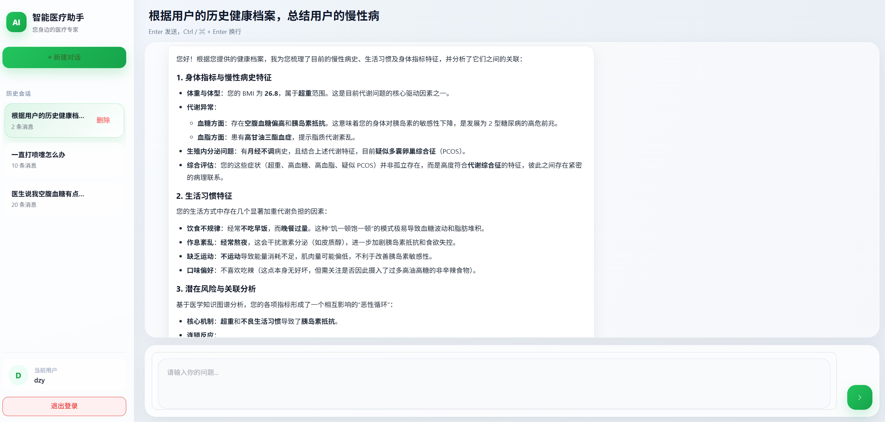

# 🩺 智能医疗助手（HealthAgent）

<p align="center">
  一个面向 <b>医疗知识问答、医保政策咨询、多轮对话记忆增强</b> 的智能医疗助手
</p>

<p align="center">
  融合 LLM多智能体、知识图谱、向量检索、长期记忆与流式输出能力，支持复杂问题拆解、多知识源协同检索与证据展示
</p>

<p align="center">
  
  
  
  
  
  
</p>

> 本项目定位为医疗信息辅助系统，用于医学知识检索、健康科普与医保政策咨询，不替代医生诊断与线下就医。

---

## 📸 项目截图

<p align="center">
  
</p>

---

## ✨ 项目亮点

### 多知识源协同问答
- 基于 **Neo4j** 实现医疗知识图谱检索
- 基于 **Qdrant / RAG** 实现医保政策知识检索
- 结合 **LLM** 对多路结果进行归纳总结与自然语言生成

### 记忆增强对话
- 基于 **Redis** 维护短期会话窗口
- 对超出窗口的历史对话进行自动摘要压缩
- 将摘要向量化写入长期记忆库
- 更新用户画像
- 支持历史记忆召回，增强多轮对话连续性

### 复杂问题拆解
- 对复合型用户问题进行任务规划与分解
- 路由到不同检索模块分别执行
- 汇总多路结果生成最终回答

### 更好的交互体验
- 支持 **SSE 流式输出**
- 支持“思考过程 / 处理中”展示
- 支持回答完成后查看证据来源与内容

### 工程化能力
- 前后端分离架构
- JWT 登录鉴权
- MySQL 持久化用户与会话数据
- Docker 化部署能力

---

## 🧰 技术栈

### 后端
- Python
- FastAPI
- SQLAlchemy
- MySQL
- Redis
- Qdrant
- Neo4j
- Docker

### 前端
- Vue3
- Pinia
- Element Plus
- Axios

### AI / 检索
- LLM多智能体
- Embedding 向量化
- RAG 检索增强生成
- 医疗知识图谱查询
- 长期记忆召回

---

## 🚀 核心功能

### 1. 医疗知识问答
支持疾病、症状、治疗方式、科室归属、易感人群、预防建议等医疗知识问答。  
后端结合 **实体识别 + 图谱检索 + LLM 总结** 输出更结构化的结果。

### 2. 医保政策问答
针对医保政策类问题，系统通过政策文档切分、向量索引与检索召回相关片段，再结合大模型生成回答，提升政策咨询场景的准确性与可解释性。

### 3. 多轮会话记忆
系统维护当前会话上下文窗口；当历史轮次超出窗口后，会进行摘要提炼并写入长期记忆库。  
后续新问题到来时，会从长期记忆中检索与当前问题最相关的历史信息，增强上下文连续性。

### 4. 复杂任务拆解
对于复合型问题，例如：

- “我最近总是头晕恶心，可能是什么问题？应该挂什么科？医保能不能报销？”
- “这个病的症状、治疗方式和医保政策分别是什么？”

系统会先进行任务拆解，再分别调用不同检索模块执行，最后汇总生成回答。

### 5. 证据展示
系统在生成回答时会保留本轮使用到的证据来源，例如：

- 图谱查询结果
- 政策库检索片段
- 历史记忆召回内容

前端支持用户点击后在侧边栏查看证据内容，增强回答透明度与可解释性。

---

## 🏗️ 系统架构

```mermaid
flowchart TD
    A[用户输入] --> B[前端 Vue3]
    B --> C[FastAPI 接口层]
    C --> D[任务规划 / 问题拆解]
    D --> E[医疗知识模块]
    D --> F[医保政策模块]
    D --> G[记忆检索模块]

    E --> E1[Neo4j 医疗知识图谱]
    E --> E2[Schema / 实体召回]
    F --> F1[Qdrant 政策向量库]
    G --> G1[Redis 短期记忆]
    G --> G2[Qdrant 长期记忆]

    E1 --> H[结果汇总]
    E2 --> H
    F1 --> H
    G1 --> H
    G2 --> H

    H --> I[LLM 生成最终回答]
    I --> J[SSE 流式返回前端]